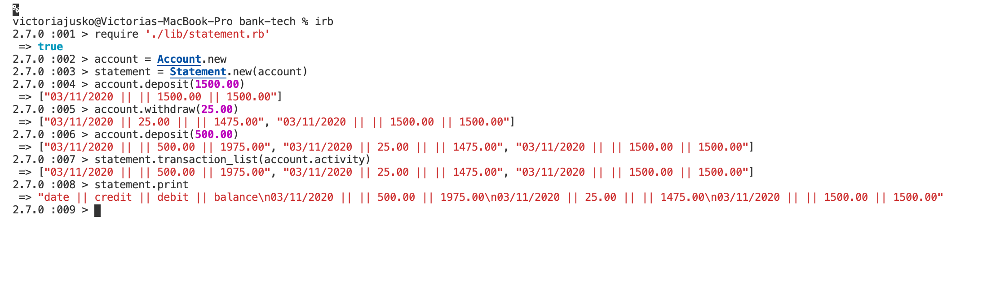

# Bank Account - Tech Test Makers:

### User stories:

 As a user, 
- So that I can keep track of my money 
- I want to have an accurate representation of balance on my account


As a user, 
- So that I can spend money, 
- I would like to be able to withdraw money from my account


As a user, 
- So that I can add money to my account, 
- I would like to be able to deposit money into my account


 As a user,
- So that I can keep track of my transactions
- I would like to be able to print a statement of my bank account that has a date, transaction activity and updated balance information. 


### Planning 

- Initial idea is to have an account class that will be responsible for storing information regarding withdrawl and depositing, the account will also update its balance and add the activity into an array. 
- Statement class is introduced at the end of creating the withdrawl and deposit classes, as it seems like it is not Account's responsibility to be printing a statement. 

### Gems added:

- simplecov
- rubocop
- rspec
- travis


## Requirements

You should be able to interact with your code via a REPL like IRB or the JavaScript console. (You don't need to implement a command line interface that takes input from STDIN.)
Deposits, withdrawal.

Account statement (date, amount, balance) printing.
Data can be kept in memory (it doesn't need to be stored to a database or anything).

## Acceptance criteria
Given a client makes a deposit of 1000 on 10-01-2012
And a deposit of 2000 on 13-01-2012
And a withdrawal of 500 on 14-01-2012
When she prints her bank statement

## How to user
```
open in irb
require './lib/statement.rb'
create a new Account class
create a new Statement class that takes the account as a parameter
deposit money / withdraw money
add Account activity to the transaction_list in Statement
print the Statement
```


 

